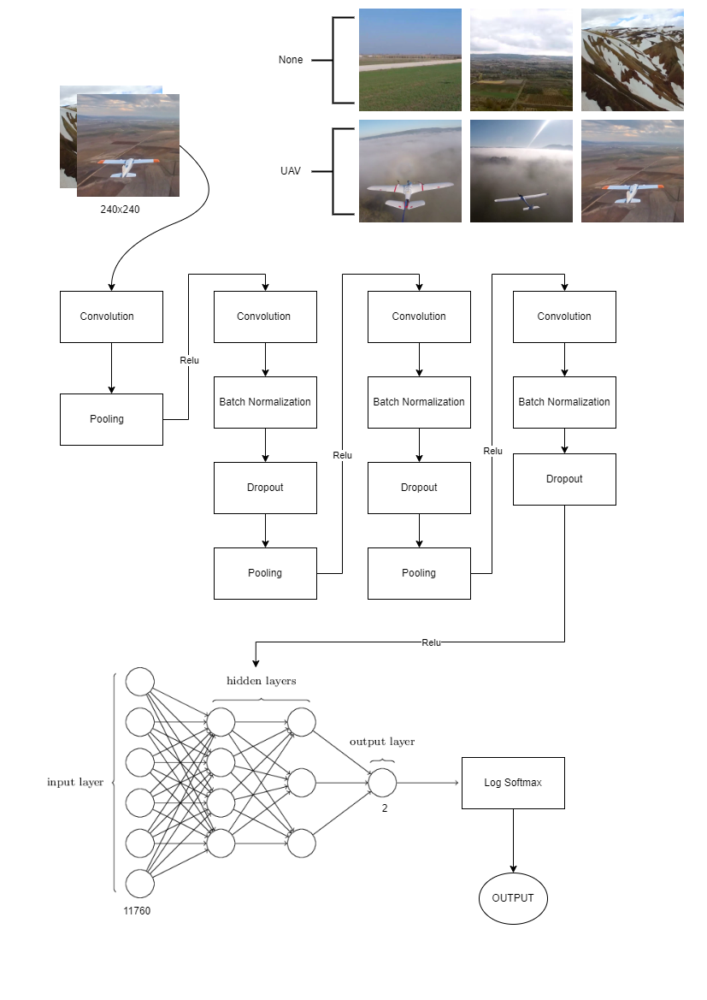

# UAV Tespiti için Sınıflandırma Modeli
Bu proje, insansız hava araçlarının (UAV'lerin) tespiti için bir sınıflandırma modeli geliştirmeyi amaçlamaktadır. Projede kullanılan veri seti, 33,100 adet UAV görüntü içeren kendi veri setimizden seçilmiştir. UAV olmayan görüntüler, projenin gereksinimlerine uygun olarak özenle seçilmiş ve temsil edici bir veri seti elde etmek için kullanılmıştır.

## Modelin Eğitimi
Modelin eğitiminde evrişimli sinir ağı (CNN) mimarisi tercih edilmiştir. CNN, görüntülerden özelliklerin çıkarılması ve sınıflandırma işleminin gerçekleştirilmesinde etkili bir yapısıyla öne çıkmaktadır. Geliştirilen model, eğitim verileri üzerinde başarılı bir şekilde eğitilmiş ve ardından doğrulama verileri üzerinde test edilmiştir.

## Veri Seti Oluşturma
Veri seti oluşturma sürecinde, Savaşan İHA Yarışması için eğittiğimiz YOLO (You Only Look Once) modeline video verileri verilerek otomatik olarak veri seti oluşturulmuştur. Bu yöntem, geniş veri setleri gerektiren projelerde veri seti oluşturmayı kolaylaştırmış ve süreci hızlandırmıştır.

## Sonuçlar
Bu projenin amacı, UAV tespiti için etkili bir sınıflandırma modeli geliştirmektir. Ancak, temsili veri setinin yeterli kalitede olmamasından dolayı model yeterli başarıyı gösterememiştir. Gelecekteki çalışmalarda, modelin daha geniş ve daha temsilci veri setleri üzerinde test edilmesi ve performansının daha da iyileştirilmesi hedeflenmektedir.

## CNN Modeli

  
